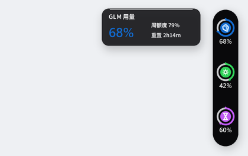

# GLM Plan Dashboard v1.27

GLM + Kimi 双源用量悬浮小组件 + 番茄工作闹钟，深色状态轨贴靠屏幕右缘：44px 宽的完整胶囊中，GLM 深蓝晶体、Kimi 绿色星芒、番茄沙漏三个图标圆环分别显示两类短期额度和当前番茄阶段剩余，图标下方显示百分比。空闲时自动缩成右缘 6px 进度细边，鼠标触及滑出，悬停单个图标展开其局部详情卡片。

## 预览



## 功能

**外观与交互（v1.27）**
- **深色胶囊 + Acrylic 详情卡片**：主轨使用近黑色自绘底与等宽端帽裁切，保证任何壁纸上都有稳定的半圆外形；局部详情卡片继续使用 Acrylic 暗色材质
- **平滑边缘**：主轨以 4 倍超采样绘制后缩小，完整展开态由逐像素 alpha 形成圆弧，避免 Win32 硬区域裁切造成的锯齿；6px 收边态仍保留独立命中区域
- **数值缓动动效**：刷新后百分比数字与进度条 30fps 指数趋近新值（ease-out 观感），收敛即停，平时零开销
- **正弦调光闪烁**：阶段切换提示由开关式闪烁改为 6 秒 3 次正弦淡入淡出
- **贴边自动隐藏**：空闲 1.2 秒滑入屏幕右缘，露出 6px **竖向番茄进度条**（顶部锚定、随剩余时间向下流干，到底即空；剩余 >50% 绿 / 20–50% 黄 / <20% 红）；鼠标触及右缘即滑出（启动后 5 秒宽限期不隐藏；拖到别处后不启用）
- **hover 详情面板**：悬停单个图标 0.3 秒，在其左侧展开 168×64 的局部详情卡片；切换图标只更新对应项，离开轨道和卡片 0.3 秒后收起

**状态轨（v1.27）**
- 44px 宽的完整胶囊内固定三枚圆环：GLM 5h 短期额度（深蓝晶体）、Kimi 5h 短期额度（绿色星芒）、当前番茄阶段剩余（工作紫 / 休息 teal / 非工作灰）。每枚图标下方显示对应剩余百分比，图标和位置保持固定，便于形成空间记忆。
- 平台主色不随额度变化，低于 40% 时用橙色小点提示，低于 15% 时用红色小点提示；精确百分比、重置时间、GLM 周额度和 Kimi 月额度全部保留在 hover 详情中。
- Kimi 本地 daemon 不可用时显示灰色虚线占位环，真实额度耗尽仍是红色警示点；番茄非工作时段使用灰色沙漏环，不把它误报为额度耗尽。
- 主轨只在状态变化时重绘：番茄钟每秒一帧、额度刷新后的缓动才 30fps，保留原有离屏 Pillow + Win32 分层窗口路径，无额外运行时依赖。
- 每 5 分钟自动刷新数据（GLM 走配置的 API，Kimi 走本地 daemon，互不阻塞失败互不影响）

**番茄工作闹钟（下段）**
- 锚定作息表：工作日 9:00–11:30、13:30–18:00 两个时段内连续跑「45 分钟工作 ↔ 15 分钟休息」；时段尾自然截断（上午 11:00–11:30、下午 17:30–18:00 为 30 分钟收尾工作段，倒计时递减到 0 正好落在午休/下班边界）
- 节假日 / 调休自适应：chinese-calendar 判定中国法定节假日与周末补班，调休补班的周末照常计时，假期显示「假日」不计时；库缺失或数据超范围时退回「周一~周五」近似
- 状态由墙钟每秒推导（非累计计时）：任意时刻启动即对位、睡眠/挂起后自动恢复、阶段边界不随运行时长漂移
- 时段外显示「待机 / 午休 / 下班 / 假日」+ 下次开工时刻；阶段切换、上/下午开工、午休、下班均弹 Windows 通知并闪烁提示
- 阶段圆点（工作=专注紫 / 休息=teal / 非工作=灰）+ 粗体阶段词（思源黑体）+ 等宽倒计时（冒号每秒呼吸）+ 5px 胶囊进度条（按标准 45/15 分钟归一，与倒计时严格同比例递减，归零即切阶段）

**通用**
- 右键菜单：立即刷新 / 退出
- 可拖拽移动位置
- 圆角半透明悬浮窗口
- 支持开机自启动（登录后启动）

## 实施方案

- **语言**: Python 3
- **GUI**: tkinter（无边框置顶窗口 + Win32 分层窗口实现逐像素透明）
- **图像**: Pillow（PIL）绘制电池图标与番茄图标，支持圆角和抗锯齿
- **番茄钟**: `root.after` 每秒驱动倒计时状态机
- **通知**: winotify（WinRT toast）+ 注册表注册应用 AUMID，显示番茄图标与应用名
- **API**: 优先实时读取 ZCode 配置（`~/.zcode/cli/config.json` 当前供应商 + `~/.zcode/v2/config.json` 的 apiKey/baseURL），调用 GLM 配额接口获取用量；详见下方「API 配置来源」
- **刷新**: 后台线程请求 API，主线程更新 UI，5 分钟轮询

## 安装与运行

```bash
pip install -r requirements.txt
python main.py             # 或双击 start.bat（pythonw 无窗口启动）
```

**API 配置来源（优先级从高到低）**：

1. **ZCode 当前配置（默认生效，自动跟随更新）**：`~/.zcode/cli/config.json` 的 `model.providerId` 记录 ZCode 当前选中的供应商，其 `apiKey` / `baseURL` 明文存于 `~/.zcode/v2/config.json` 的 `provider[<id>].options`。仪表盘每次刷新（5 分钟）都现读这两个文件，**在 ZCode 里换 key、换供应商后无需任何手动操作**，最迟一个刷新周期自动生效。若活动供应商无可用 key（如切换到 OAuth 类套餐），自动改用配置中任一已启用且带 key 的供应商。
2. **项目 `config.json`**（已被 `.gitignore` 忽略，不会上传 key）：ZCode 不可用时的独立兜底，由 `setup_config.py` 固化。
3. **环境变量** `ANTHROPIC_BASE_URL` / `ANTHROPIC_AUTH_TOKEN`。
4. **`~/.claude/settings.json`** 的 `env` 字段（兼容 Claude Code）。

> **刷新兜底 key**：兜底 `config.json` 里的 key 过期后，重跑 `python setup_config.py` 即可——它会跳过已有 `config.json`，从 ZCode / 环境变量 / `~/.claude/settings.json` 读取最新配置写入。

**开机自启**：悬浮窗上右键 →「开机自启（点击切换）」，开启后登录 Windows 自动后台启动；对应注册表项 `HKCU\Software\Microsoft\Windows\CurrentVersion\Run` 的 `GlmDashboard`。

## 更新日志

### v1.27
- **44px 深色胶囊状态轨**：主轨收窄为上下半圆端帽的近黑色胶囊；GLM、Kimi 与番茄阶段均以「品牌色底盘 + 进度圆环 + 下方剩余百分比」呈现。
- **按项 hover 详情**：悬停图标只显示对应的 168×64 局部详情卡片，切换项目时原卡片直接更新定位，不再展开整条状态轨的汇总面板。
- **边缘质量**：完整状态改为逐像素 alpha 圆弧，并以 4 倍超采样后缩小，移除 Win32 硬区域裁切导致的端帽锯齿；绘制约 2.4ms/帧。

### v1.26
- **窄幅状态轨**：140px 横向胶囊卡改为 56px 三槽轨道；GLM 深蓝晶体、Kimi 绿色星芒和番茄沙漏外圈展示短期额度或当前阶段剩余，悬停详情继续承载精确读数与重置/周/月信息。
- **状态语义**：低额度使用橙/红警示点，不覆盖平台品牌色；Kimi 无数据、真实额度耗尽和番茄非工作状态采用不同图形，避免把空态误报为低额度。
- **渲染负载**：删除主卡内不再呈现的重置进度动画和长周期数值缓动，主轨只平滑更新两类短期额度。

### v1.25
- **上段改版为 macOS 用量监控式横向胶囊条**：弃用 v1.21 的「TOKEN 竖排 + GLM/KIMI 各三根竖条」三列布局，改为每个平台一组标题 + 三行「左标签（5h / 重置 / 周、月）+ 右数值 + 下方横向胶囊进度条」——标签与百分比在条上方、深灰轨道 + 分级色填充，贴参考图样式。卡片 140×192 → 140×232 加高容纳六行，番茄钟下段整体下移。顺带改进：周/月剩余条由恒红改为与 5h 条一致的分级色；重置行新增 `H:MM` 倒计时数字（此前竖条无数字）；删除不再使用的 `_draw_vertical_capsule` / `_draw_column_header`

### v1.24
- **修复贴边隐藏在多屏环境下的两处越界**：① 细边唤出热区右界越出屏缘 8px 落在邻屏左缘上，鼠标在邻屏左缘移动就把卡片拽出再缩回，表现为卡片在两屏间反复弹跳——热区收紧为严格在本屏内（`px < sw`，屏缘内侧 16px 仍可正常唤出）；② 隐藏态漏撤 DWM 圆角偏好，DWM 按窗口矩形（身体伸在邻屏上）描出一圈整卡轮廓线——细边模式切换时同时改 DONOTROUND，邻屏彻底干净，严格只在本屏边缘显示一条竖向番茄进度条

### v1.23
- 多屏贴边修复：所在屏按可见锚点判定 + 停靠位置记忆（`ui_state.json`）；隐藏改原地缩边（region 裁窄 + 关 Acrylic，邻屏无残影）；悬空带计入热区消除贴边弹跳；DWM 圆角偏好让毛玻璃底真正圆角

### v1.22
- **苹果风改版 · 材质**：Win11 Acrylic 真毛玻璃背景（`SetWindowCompositionAttribute` + 暗色 tint），替代 PIL 自绘卡片底；圆角改用 `SetWindowRgn` 裁剪 12px（`DWMWA_WINDOW_CORNER_PREFERENCE` 与分层窗口渲染冲突会致窗口不可见，故弃用）；发丝描边与顶部内高光保留；API 不可用的老系统自动回退 PIL 自绘卡片
- **苹果风改版 · 动效**：用量数字/进度条刷新后 30fps 指数缓动到新值（`_set_targets` / `_animate_tick`，收敛即停零开销）；番茄钟阶段切换闪烁改为 6 秒 3 次正弦调光；抓取结果改由 `_apply_usage` 在 UI 线程统一应用，顺带消除后台线程直改状态的隐患
- **苹果风改版 · 交互**：贴边自动隐藏——停靠右缘且空闲 1.2 秒滑出屏幕只留 6px 微光细边（`_create_strip_image` 竖向光条提示位置），指针触及右缘滑回，启动 5 秒宽限；hover 0.4 秒从卡片左缘滑出 Acrylic 详情面板（`create_detail_image`，精确百分比 / 重置时刻 / 番茄钟 / 上次刷新），指针离开收回；拖拽时自动收起面板且不触发隐藏
- **分层窗口渲染顺序约束**：Acrylic / SetWindowRgn 必须在首次 `UpdateLayeredWindow` 之后应用，否则渲染通道不生效、窗口整体不可见（主卡片与详情面板共用此顺序）
- 排版微调：列顶数字 11→12px；详情面板中文走中文字体（Segoe 无 CJK 字形）
- **修复番茄钟进度条与剩余时间不符**：时段尾截断段（11:00–11:30 / 17:30–18:00 的 30 分钟收尾段）进度按截断后时长归一，导致「剩 24 分钟却显示 82%」；改为始终按标准阶段时长（45/15 分钟）归一，进度条读数与倒计时严格同比例，截断段从 67% 起步
- **贴边细边升级为竖向番茄进度条**：隐藏后露出的 6px 细边显示当前阶段剩余比例——顶部锚定向下流干、到底为空，颜色按剩余比例分级（>50% 绿 / 20–50% 黄 / <20% 红），收起状态也能一眼看出还能撑多久
- **渲染性能**：`_update_layered_window` 的 premultiply 由 Python 逐字节循环改为 `ImageChops.multiply`（C 层逐像素），消除每秒重绘与 30fps 动画时的卡顿
- **中文换思源黑体**：`ZH_FONT` 首选 NotoSansSC-VF（思源黑体可变字体，wght=700；`_load_font` 新增 weight 参数支持可变字体轴），缺失时回退微软雅黑/黑体；数字保留 Segoe UI 等宽步进

### v1.21
- **上段重排为三列双平台布局**：第一列竖排「TOKEN」标识（竖发丝线分组）；第二列「GLM」三条竖向进度条（短期剩余 / 5h 重置倒计时 / 周剩余，原三条横条全部竖向化）；第三列「KIMI」三条竖向进度条（短期剩余 / 5h 重置倒计时 / 月额度剩余）。列顶各带短期剩余小数字（无数据显示「--」）。卡片 84→140px 加宽，番茄钟下段不变
- **新增 Kimi 用量源**：读 Kimi Code CLI 本地 daemon（`~/.kimi-code/server/instances/*.json` 动态端口按心跳取最新 + `server.token` 鉴权），请求 `/api/v1/oauth/usage` 解析 `limit5h` 与 `monthTotal` 的 `usedRatio/resetAt`；实测该账号无 `limit7d`（周窗口），长周期额度按月度显示。daemon 未跑时保持空轨道不伪造读数
- **修复网络读取超时未捕获**：`urlopen` 只把连接阶段超时包成 `URLError`，读响应阶段的裸 `TimeoutError` 不在捕获列表，网络抖动会让刷新线程带 traceback 崩一轮；两处 fetch 补 `OSError` 兜底
- 通用化重置倒计时逻辑（`_reset_frac` / `_reset_pulse`），GLM 与 Kimi 黄竖条共享整分心跳与满刻度校准

### v1.20
- **黄条整分心跳脉冲**：5h 满刻度摊在 56px 条宽上每分钟只收缩约 0.2px（5 分钟才挪 1 像素），窗口重置倒计时条视觉上"不走字"。新增 `_quota_pulse()`——每分钟第 0 秒达峰、6 秒内线性衰减，黄条填充色向白混合（峰值 60%）后渐回，借每秒重画帧形成整分心跳，用颜色节律代替不可见的位移。无 `nextResetTime`（空轨道）与番茄钟闪烁（dim）期间不脉冲。

### v1.19
- **短期与周额度分离**：主 `TOKEN` 数字与黄色重置条只读取 `TOKENS_LIMIT unit=3` 的 5 小时窗口；此前按 `nextResetTime` 选择时，短期窗口缺少重置时间会误选周窗口，造成主数值显示周额度剩余。短期响应不含 `nextResetTime` 时，黄色条保持空轨道而不伪造倒计时。周窗口（`unit=6`）改由右缘红色竖条展示剩余比例，额度下降时从上向下收缩；tooltip 同时给出两种额度的明确文字。

### v1.18
- **番茄钟进度条统一为倒计时语义**：由「已进行比例从空涨满」改为「剩余比例从满缩空」，与倒计时数字同向递减，也与 Token 剩余条、窗口重置条的全卡「剩余递减」语义统一；阶段开始满格、归零切换下一阶段（`_pomo_state` 的 `progress` 字段相应改为剩余比例）

### v1.17
- **新增短期额度窗口重置倒计时进度条**：Token 剩余胶囊条正下方加 3px 细条，显示最先重置的 TOKENS_LIMIT 窗口距重置（额度回满）的剩余比例——黄色（iOS systemYellow）填充 + 亮白轨道，满=刚重置、空=即将重置，配合剩余量判断「趁重置前冲掉剩余额度 / 等回满再爆量」。满刻度按 5 小时起步，每次拉取用实际跨度动态上调校准；`fetch_usage` 相应返回 `reset_ts`，tooltip 增加「窗口 XhXXm 后重置」
- **用量请求加固（SSRF 防护）**：新增 `_validated_usage_url()`——仅允许 https + 平台白名单域名，DNS 解析后逐 IP 阻断私网/环回/链路本地/保留地址；禁用 HTTP 重定向跟随（`_NoRedirect`）；拉取失败时保持上次读数不再误显满电

### v1.16
- **番茄钟锚定工作作息表**：由「任意时刻启动的自由 50/10 循环」改为按工作日 9:00–11:30、13:30–18:00 两个时段跑 45 分钟工作 + 15 分钟休息；状态每秒从墙钟推导（`_pomo_state()`），启动即对位、睡眠恢复不漂移。时段尾自然截断成 30 分钟收尾工作段，倒计时归零恰落在午休/下班边界
- **节假日/调休自适应**：新增 `chinese-calendar` 依赖，`_is_workday()` 判定法定节假日与周末补班（每年国务院安排），补班周六/日照常计时，假期显示「假日」；缺库或数据超范围退回周一~周五
- **时段外状态**：显示「待机（9:00 前）/ 午休（11:30–13:30）/ 下班（18:00 后）/ 假日」+ 下次开工时刻；开工、午休、下班、阶段切换均弹通知并闪烁；非工作时段阶段点用 iOS systemGray
- 通知文案随新节奏更新（45/15、上/下午开工、午休/下班）

### v1.15
- **API 配置与 ZCode 保持一致并自动跟随**：配置读取最高优先级为 ZCode 来源——`~/.zcode/cli/config.json` 的 `model.providerId` 定位当前供应商，`~/.zcode/v2/config.json` 的 `provider[<id>].options` 取 `apiKey` / `baseURL`。每次刷新（5 分钟）现读文件，ZCode 里换 key / 换供应商后无需任何手动同步。活动供应商无可用 key（如 OAuth 类套餐）时自动改用任一已启用且带 key 的供应商；ZCode 配置缺失时依次落回项目 `config.json` > 环境变量 > `~/.claude/settings.json`（v1.9 层级整体后移一位）。`setup_config.py` 同步更新为固化 ZCode 当前配置作兜底。

### v1.14
- **视觉层级微调**：`TOKEN` 标签由 10px 提升为 14px 粗体，与「工作 / 休息」阶段词同级；字距收窄为 1px，保留窄卡片的左右留白
- **进度条统一**：番茄钟进度条由 3px 加粗至 5px，与 Token 胶囊进度条使用相同的视觉厚度
- **低余量告警完整性**：Token 低于 15% 时，`%` 单位随数字使用系统红，避免单位保留白色而削弱告警语义

### v1.13
- **竖版 Apple 风格重设计（与 cc cli 研讨定稿）**：悬浮窗从 121×73 横条改为 **84×192 竖版卡片**，默认停靠屏幕右缘（悬空 8px、竖直居中），不再是顶部横条
- **配色升级为 iOS 暗色系统色**：卡片 `#1C1C1E` @75% 半透明 + 1px 白色发丝描边 + 顶部内高光（伪玻璃质感）；Token 分级色改为绿 `#30D158`（≥40%）/ 橙 `#FF9F0A`（15-40%）/ 红 `#FF453A`（<15%，大数字同步染红）
- **版式重排**：上段「TOKEN」粗体字距标签（10px Segoe UI Bold）+ 26px Segoe UI Semibold 大数字（`%` 缩小上标）+ 5px 胶囊进度条；发丝分隔线（两端内缩）；下段阶段圆点（工作=专注紫 `#BF5AF2` / 休息=teal `#64D2FF`，刻意避开电量三色）+ 粗体阶段词（14px 微软雅黑粗体）+ 20px 等宽倒计时 + 3px 细进度条（随秒缩减）
- **数字细节**：倒计时逐字符等宽步进绘制（伪 tabular，秒针跳动零抖动），冒号每秒呼吸（alpha 255↔150）
- 抗锯齿改为 3 倍超采样（252×576 画布 → LANCZOS 缩小）

### v1.12
- **用量 API 调用方式对齐 cc cli**：`fetch_usage` 的 base_domain 提取从 `base_url.split("/api/anthropic")` 改为标准 `urlparse`（取 `scheme://host`），与 glm-plan-usage 插件 `query-usage.mjs` 的 `new URL()` 等价，不再依赖 URL 必须含 `/api/anthropic` 子串；新增已知平台校验（`api.z.ai` / `open.bigmodel.cn` / `dev.bigmodel.cn`），未识别域名直接跳过请求并记录，不再发出注定失败的调用；请求头 `Accept-Language` 由 `zh-CN,zh` 改为 `en-US,en`。端点（`/api/monitor/usage/quota/limit`）与认证方式（裸 token）不变，解析逻辑（取 `TOKENS_LIMIT` 中 `nextResetTime` 最小的短期窗口）不变。

### v1.11
- **修复 `setup_config.py` 无法刷新 token 的问题**：此前 `read_raw_config` 优先读取项目 `config.json`，导致 `config.json` 已存在时重跑 `setup_config.py` 只会把旧 token 读出再写回、永远同步不到 `~/.claude/settings.json` 的新值（v1.9 引入该配置层级时的副作用）。为 `read_raw_config` 新增 `skip_local_config` 参数（默认 `False`，仪表盘运行时的 `load_config` 行为不变、仍优先读 `config.json`），`setup_config.py` 调用时传 `True`，强制从「环境变量 → `~/.claude/settings.json`」读取后写入 `config.json`。今后换 token 直接重跑 `setup_config.py` 即可，无需手动编辑或删除 `config.json`。

### v1.10
- **运行日志落盘便于故障定位**：pythonw（任务计划程序 / 开机自启）无控制台环境下，原先把 `sys.stdout/stderr` 重定向到 `os.devnull`，运行期错误无处可查；改为写入项目内 `dashboard.log`（append），API 错误与未捕获异常的 traceback 均会落盘。`dashboard.log` 已加入 `.gitignore`，不会上传。

### v1.9
- **彻底脱离 Claude Code 独立运行**：新增项目本地 `config.json`，配置读取优先级改为 `config.json > 环境变量 > ~/.claude/settings.json`；提供 `setup_config.py` 一键把当前配置固化进项目，卸载 cc 或更换其配置均不影响仪表盘
- **补齐开机自启**：右键菜单新增「开机自启（点击切换）」，写入 `HKCU\Software\Microsoft\Windows\CurrentVersion\Run` 注册表项，登录后用 `pythonw` 无窗口自动启动（v1.4 仅修复了被自启调用时的 stdout 崩溃，并未真正实现注册自启，本次补全）

### v1.8
- **修复 Python 3.13 升级后悬浮窗不可见的问题**：Python 3.13 自带的新版 Tk 中，`Tk().winfo_id()` 返回的是 `TkChild` 子窗口句柄，而非真正的顶层窗口句柄，导致 Win32 分层窗口（`WS_EX_LAYERED` + `UpdateLayeredWindow`）渲染失效、悬浮窗全透明不可见（进程仍在后台静默运行）。新增 `_toplevel_hwnd()` 沿 `GetParent` 上溯到真正的顶层窗口句柄后再渲染，兼容新旧 Tk 版本

### v1.7
- **番茄钟时长调整**：工作时长由 45 分钟延长至 50 分钟，休息时长由 5 分钟延长至 10 分钟（每个周期合计 1 小时），同步更新阶段切换通知文案

### v1.6
- **修复内存 / GDI 泄漏**：字体对象改为按字号缓存（`_FONT_CACHE` + `_load_font`），修复每秒重复 `ImageFont.truetype` 加载导致 GDI 字体对象阶梯式增长、长时间运行内存膨胀的问题
- **默认位置调整**：悬浮窗默认位置从屏幕右下角改为屏幕1 顶部水平居中（`x=(屏宽-窗口宽)//2`、`y=10`）

### v1.5
- **集成番茄工作闹钟**：悬浮窗改为上下双行布局，上行电池图标 + Token 剩余百分比，下行番茄钟倒计时（45 分钟工作 ↔ 5 分钟休息自动循环）
- 倒计时改用 `root.after` 每秒驱动（替代阻塞式 `time.sleep`），事件循环不再卡顿
- 阶段结束时弹出 Windows 通知，倒计时区域闪烁变色
- **通知美化**：改用 winotify（WinRT toast）+ 注册表注册应用 AUMID，通知显示番茄图标与应用名「GLM 仪表盘」，解决默认 PowerShell 图标问题
- 新增 `tomato.ico` / `tomato.png` 番茄图标资源；`requirements.txt` 新增 `winotify`

### v1.4
- 电池图标尺寸调整：长度（水平）加长 50%、宽度（垂直）加宽 10%，百分比文字保持居中
- 新增开机自启动支持：修复 `pythonw` 在无控制台环境（任务计划程序 / 开机自启）下 `sys.stdout` 为 `None` 导致 `print` 崩溃的问题，输出重定向至 `os.devnull`

### v1.3
- 使用 Win32 分层窗口（`UpdateLayeredWindow`）替代 `transparentcolor` 方案，实现真正的逐像素 Alpha 透明
- 圆角背景现在具有平滑的抗锯齿边缘，不再有毛边或倒角
- 背景卡片圆角半径增大（radius=30），外观更圆润
- 调整整体透明度为 92% 不透明度，背景更扎实

### v1.2
- 百分比文字嵌入电池图标内部，取代原有的右侧文字布局
- 电池图标上下左右居中于背景卡片
- 背景卡片高度增加 30%、宽度缩小 20%，整体比例更紧凑
- 整体放大 20%，提升可读性
- 百分比文字使用加粗字体（Arial Bold）

### v1.1
- 使用 `pythonw` 替代 `python` 启动脚本，隐藏 CMD 黑窗口

### v1.0
- 初始版本：GLM 套餐用量悬浮小组件
